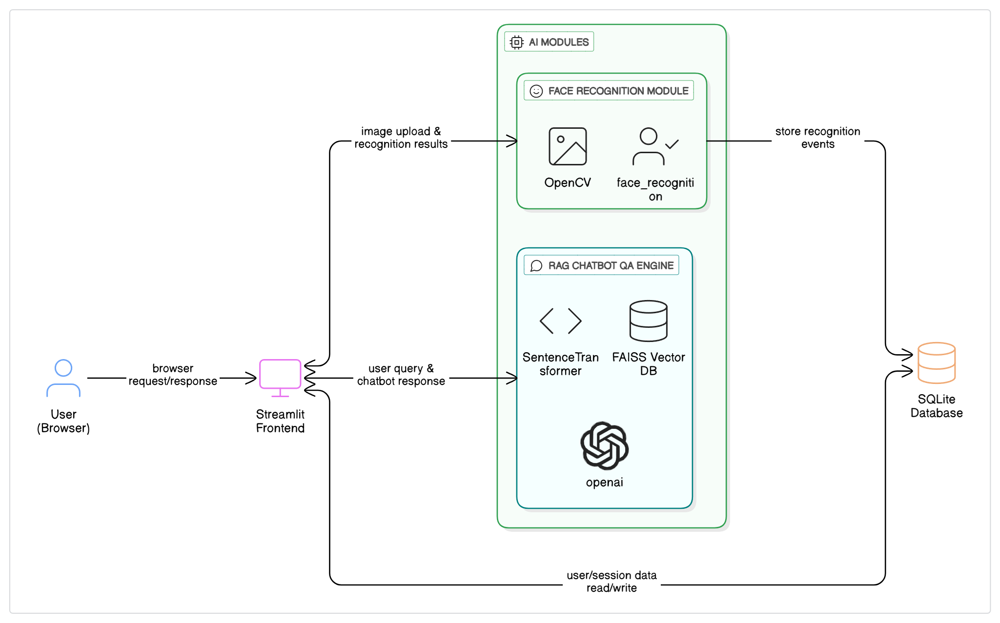

# 👤 Face Recognition Platform with RAG-Powered Chatbot

This project is a browser-based Streamlit app for:

- 📸 Face Registration via webcam
- 👁️ Real-time Face Recognition
- 💬 AI Chatbot for querying face registration activities

---

## 🔧 Features

### 1. Register Face
- Captures a user's face from webcam
- Encodes using `face_recognition`
- Stores name and timestamp in SQLite

### 2. Live Recognition
- Streams webcam input
- Matches against known faces
- Shows bounding boxes and names

### 3. Chatbot Interface (RAG)
- Ask questions like:
  - “Who was last registered?”
  - “At what time was John registered?”
- Uses `SentenceTransformer`, `FAISS`, and `Flan-T5` to respond intelligently

### 4. Verification-Based Chatbot Access
- Chatbot opens only after user verifies identity by face

### 5. Logging
- All events like registration, recognition, verification, and questions are logged in `logs/app.log`

---

## 🧠 Tech Stack

| Module            | Technology                           |
|-------------------|---------------------------------------|
| Frontend          | Streamlit                             |
| Face Recognition  | Python, OpenCV, face_recognition      |
| RAG Engine        | SentenceTransformer, FAISS, Flan-T5   |
| Database          | SQLite                                |
| LLM               | google/flan-t5-base                   |

---

## 🏗️ Architecture



---

## 🚀 How to Run

### Step 1: Clone the Repo
```bash
git clone https://github.com/your-username/face-recognition-rag-chatbot.git
cd face-recognition-rag-chatbot

Step 2: Install dependencies
```bash
pip install -r requirements.txt

Step 3: Run the Streamlit app
```bash
streamlit run app.py


📢 **Credits**
**This project is a part of a hackathon run by https://katomaran.com**

